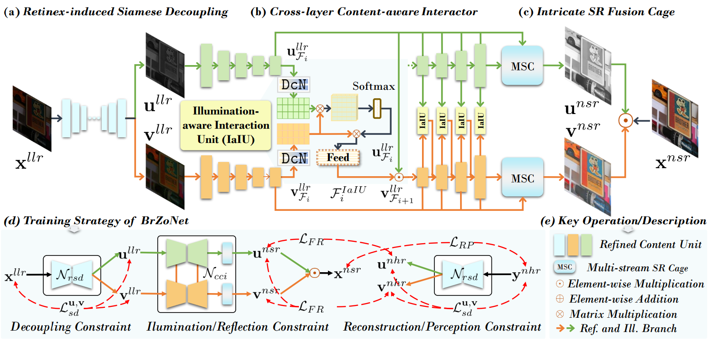
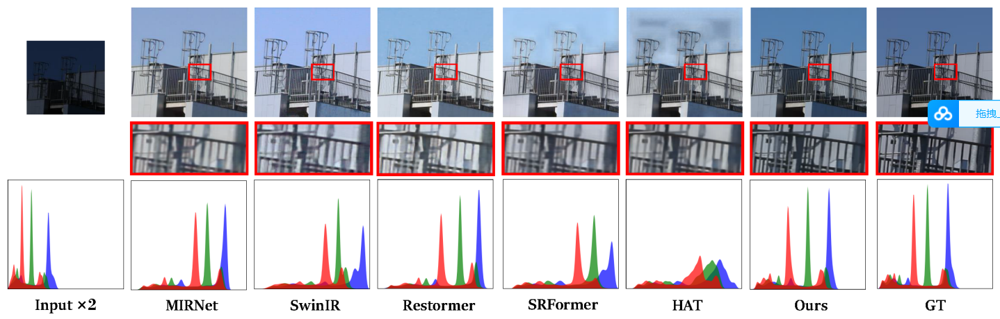
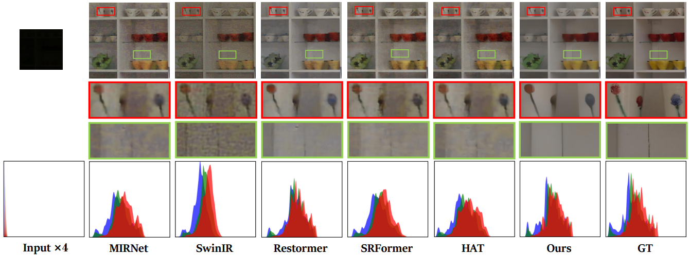

# [AAAI 2024] Unveiling Details in the Dark: Simultaneous Brightening and Zooming for Low-Light Image Enhancement [[Paper]](https://ojs.aaai.org/index.php/AAAI/article/view/28515)
By Ziyu Yue, Jiaxin Gao,  Zhixun Su

## Pipeline
<p align="center">
    
</p>


## Dependencies
```
conda create -n pytorch1 python=3.*
conda activate pytorch1
conda install pytorch=1.1 torchvision=0.3 cudatoolkit=9.0 -c pytorch
pip install matplotlib scikit-image opencv-python yacs joblib natsort h5py tqdm
````

## Download the raw training and evaluation datasets
### Paired dataset 
RELLISUR dataset: Andreas Aakerberg, Kamal Nasrollahi, Thomas Moeslund. "RELLISUR: A Real Low-Light Image Super-Resolution Dataset". NeurIPS Datasets and Benchmarks 2021. [RELLISUR](https://vap.aau.dk/rellisur/)


## Pre-trained Models 
- Download the pre-trained models and place them in `./pretrained_models/`: 
You can download our pre-trained model from [[Baidu Yun (extracted code:51ir)]](https://pan.baidu.com/s/1JXZmUSoD9vGArAgPlKunMg)

## How to train?
You need to modify ```datasets/dataset.py``` slightly for your environment
Then train MIRNet_v2 with default settings, run
```
cd BrZoNet
sh train.sh
```

## How to test?
```
python basicsr/test.py -opt /Super_Resolution/Options/msc_retinex_srnet_v12_scale2_test.yml  # For x2 task
python basicsr/test.py -opt /Super_Resolution/Options/msc_retinex_srnet_v12_scale4_test.yml  # For x4 task
```


## Visual comparison
 
<p align="center">
    
</p>
 
<p align="center">
    
</p>

## Citation
If you use this code or ideas from the paper for your research, please cite our paper:
```
@inproceedings{yue2024unveiling,
  title={Unveiling Details in the Dark: Simultaneous Brightening and Zooming for Low-Light Image Enhancement},
  author={Yue, Ziyu and Gao, Jiaxin and Su, Zhixun},
  booktitle={Proceedings of the AAAI Conference on Artificial Intelligence},
  volume={38},
  number={7},
  pages={6899--6907},
  year={2024}
}
```

## Acknowledgement
Part of the code is adapted from previous works: [BasicSR](https://github.com/XPixelGroup/BasicSR) and [MIRNet](https://github.com/swz30/MIRNet) (code structure). We thank all the authors for their contributions.

Please contact me if you have any questions at: 11901015@mail.dlut.edu.cn

